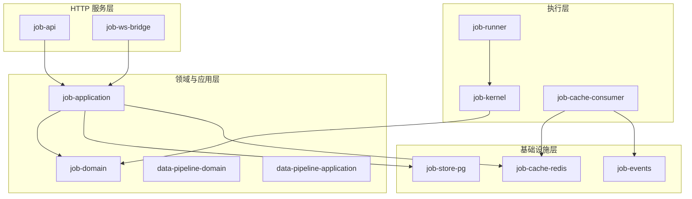
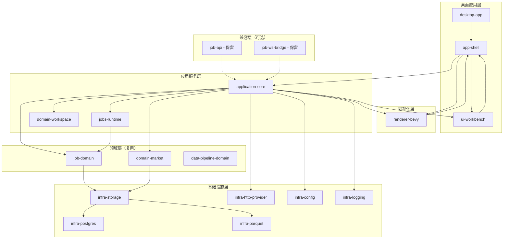
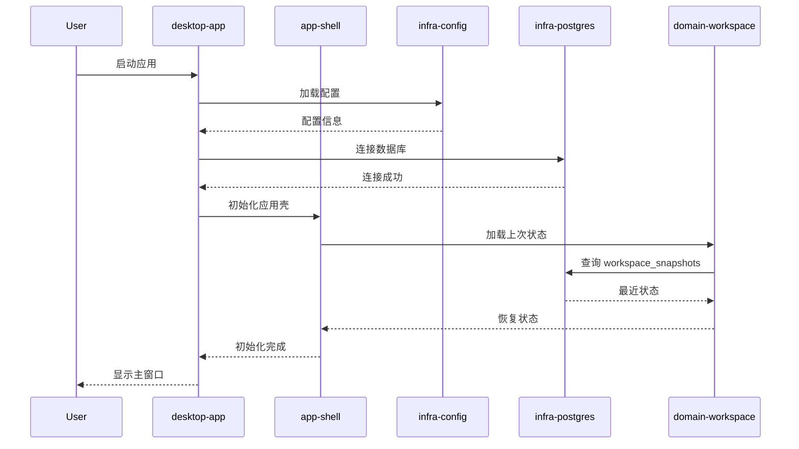
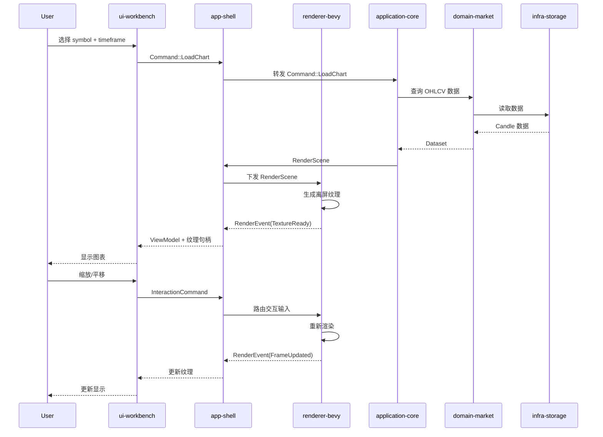
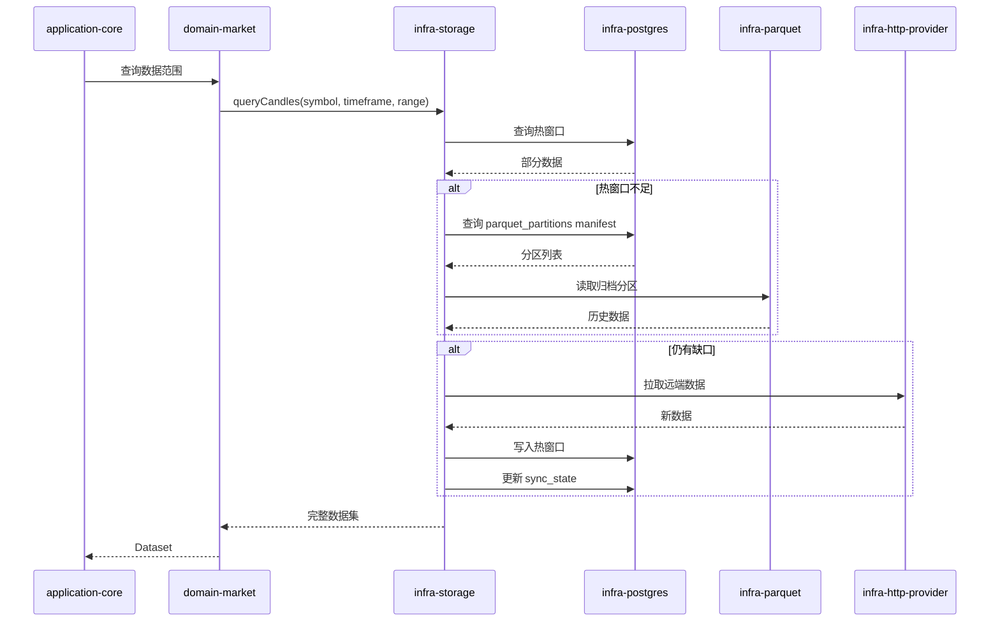
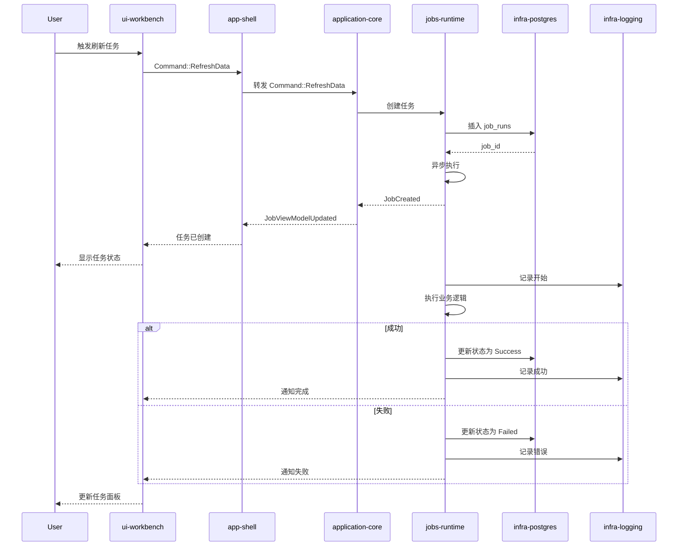

# 设计文档：zquant 企业版演进路线图

## 概述

本设计文档描述了 zquant 从"任务服务化后端底座"演进为"Windows 本地研究工作台"的技术方案。核心策略是**保留现有 job/data-pipeline 后端底座 + 新增 desktop shell**，通过四个里程碑（M1-M4）逐步实现从服务化架构到桌面应用的平滑过渡。

演进目标：
- 产品形态：从 HTTP 服务转向 Windows 桌面应用
- 前端技术：引入 egui 作为应用壳，Bevy 作为中心画布渲染引擎
- 存储架构：PostgreSQL（控制面/状态面）+ Parquet（归档面/批量扫描）
- 调用模型：从 HTTP 服务调用转向进程内应用服务调用，保留 HTTP 接口作为兼容层

本方案不推翻现有 Rust 后端资产，而是通过新增桌面层、调整调用模型、引入分层存储来实现架构演进。

## 架构

### 当前架构（As-Is）



### 目标架构（To-Be）



### 架构演进对比

| 维度 | As-Is（服务化） | To-Be（桌面化） |
|------|----------------|----------------|
| 产品形态 | HTTP API + WebSocket | Windows 桌面应用 |
| 前端技术 | 无（或外部 Web 前端） | egui + Bevy |
| 调用模型 | HTTP 请求/响应 | 进程内函数调用 |
| 状态管理 | 无状态服务 | 桌面应用状态 + Workspace |
| 存储架构 | PostgreSQL + Redis + Kafka | PostgreSQL + Parquet |
| 部署方式 | 多进程服务 | 单一桌面进程 |
| 扩展性 | 水平扩展服务 | 本地单机优先 |

### 架构硬边界（不可违反）

> 本节约束为实现期强制规则，优先级高于插件默认行为。

1. **core/domain 纯净性**
   - `core/domain` 只承载业务模型、用例、状态机、命令、事件、校验规则。
   - 禁止依赖 `egui`、`bevy`、`bevy_ecs`、`wgpu`。

2. **契约通信，禁止直连**
   - `UI -> Core`：`Command`
   - `Core -> UI`：`ViewModel / DTO`
   - `Core -> Renderer`：`RenderScene / RenderCommand`
   - `Renderer -> Core/UI`：`RenderEvent / PickingResult / FrameStats`
   - 禁止 `ui-egui <-> renderer-bevy` 直接双向依赖或共享可变内部状态。

3. **egui 主界面编排**
   - 主界面结构（导航、菜单、Dock/Tab、日志、设置、弹窗）由 `egui` 决定。
   - `renderer-bevy` 仅负责渲染面板内容，不负责主应用界面编排。

4. **默认插件行为不等于产品架构**
   - 不以 `bevy_ui` 作为主业务 UI 框架。
   - 不把 `bevy_egui` 当纯调试 overlay 使用。
   - 不让默认 render graph 顺序决定产品分层。
   - 不把 ECS 当业务数据库。

5. **输入路由权归 app-shell**
   - 输入焦点、滚轮、拖拽、快捷键冲突统一由 `app-shell` 裁决后分发。
   - `ui-workbench` 与 `renderer-bevy` 仅消费路由后的输入。

### 依赖方向与状态分治

推荐依赖方向：

```text
ui_egui ------\
               -> app_shell -> core/domain -> infra_*
renderer_bevy -/
```

状态归属：
- 业务真状态：`core/domain`（项目、策略参数、数据源配置、任务状态、回测条件）
- 渲染派生状态：`renderer-bevy`（相机、GPU 高亮、帧统计、picking/hover、纹理句柄）

禁止将业务真状态挂入 ECS Resource 作为权威来源。

## 主要工作流程

### M1 阶段：桌面壳启动与状态初始化



### M2 阶段：Bevy 画布渲染流程



### M3 阶段：数据分层读取流程



### M4 阶段：任务执行与状态管理



## 组件和接口

### 桌面应用层

#### desktop-app

**职责**：桌面应用主入口，负责初始化和生命周期管理

**接口**：

```pascal
STRUCTURE DesktopApp
  config: AppConfig
  shell: AppShell
  runtime: Runtime
END STRUCTURE

PROCEDURE initialize()
  OUTPUT: Result<DesktopApp>
  
  SEQUENCE
    config ← loadConfig()
    runtime ← createRuntime()
    shell ← AppShell.new(config, runtime)
    RETURN Ok(DesktopApp { config, shell, runtime })
  END SEQUENCE
END PROCEDURE

PROCEDURE run()
  INPUT: self
  OUTPUT: Result<()>
  
  SEQUENCE
    WHILE NOT self.shell.should_close() DO
      self.shell.update()
      self.shell.render()
    END WHILE
    
    self.shutdown()
    RETURN Ok(())
  END SEQUENCE
END PROCEDURE
```

#### app-shell

**职责**：egui 应用壳与应用协调层，负责窗口、菜单、工具栏、输入路由和跨层编排

**硬边界**：
- 统一输入路由与冲突裁决（UI 表单 vs 渲染视口）
- 统一转发 `Command / DTO / Event`，禁止 UI 与渲染器直连
- 不保存业务权威状态，只维护壳层临时状态与路由上下文

**接口**：

```pascal
STRUCTURE AppShell
  window: Window
  shell_state: ShellState
  input_router: InputRouter
  app_core: ApplicationCorePort
  renderer: RendererPort
  workbench: Workbench
END STRUCTURE

PROCEDURE new(config, runtime)
  INPUT: config: AppConfig, runtime: Runtime
  OUTPUT: AppShell
  
  SEQUENCE
    window ← createWindow(config.window_config)
    shell_state ← ShellState.load_or_default()
    input_router ← InputRouter.new()
    app_core ← ApplicationCorePort.new(runtime)
    renderer ← RendererPort.new()
    workbench ← Workbench.new()
    
    RETURN AppShell { window, shell_state, input_router, app_core, renderer, workbench }
  END SEQUENCE
END PROCEDURE

PROCEDURE update()
  INPUT: self
  OUTPUT: ()
  
  SEQUENCE
    events ← self.window.poll_events()
    
    FOR EACH event IN events DO
      routed ← self.input_router.route(event, self.workbench.focus_state())
      self.dispatch_routed_input(routed)
    END FOR
    
    ui_commands ← self.workbench.drain_commands()
    self.app_core.execute_batch(ui_commands)
    
    vm ← self.app_core.pull_view_model()
    self.workbench.update(vm)
    
    render_scene ← self.app_core.pull_render_scene()
    self.renderer.apply_render_scene(render_scene)
    
    render_events ← self.renderer.drain_events()
    self.app_core.handle_render_events(render_events)
  END SEQUENCE
END PROCEDURE

PROCEDURE render()
  INPUT: self
  OUTPUT: ()
  
  SEQUENCE
    self.window.begin_frame()
    self.render_top_bar()
    self.workbench.render()
    self.render_status_bar()
    self.window.end_frame()
  END SEQUENCE
END PROCEDURE
```

#### ui-workbench

**职责**：工作台布局管理，包含侧边栏、中心画布、右侧面板、底部面板

**硬边界**：
- 只消费 `ViewModel/DTO` 并产出 `Command`
- 不直接访问 `ApplicationCore` 内部状态
- 不直接访问 `renderer-bevy` world/resource

**接口**：

```pascal
STRUCTURE Workbench
  layout: WorkbenchLayout
  vm: MainWorkspaceVm
  sidebar: Sidebar
  center_canvas: CenterCanvas
  right_dock: RightDock
  bottom_dock: BottomDock
  pending_commands: List<Command>
END STRUCTURE

STRUCTURE WorkbenchLayout
  sidebar_width: f32
  right_dock_width: f32
  bottom_dock_height: f32
  sidebar_visible: bool
  right_dock_visible: bool
  bottom_dock_visible: bool
END STRUCTURE

PROCEDURE render()
  INPUT: self
  OUTPUT: ()
  
  SEQUENCE
    IF self.layout.sidebar_visible THEN
      self.sidebar.render()
    END IF
    
    self.center_canvas.render()
    
    IF self.layout.right_dock_visible THEN
      self.right_dock.render()
    END IF
    
    IF self.layout.bottom_dock_visible THEN
      self.bottom_dock.render()
    END IF
    
    self.pending_commands.append(self.collect_user_commands())
  END SEQUENCE
END PROCEDURE

PROCEDURE drain_commands()
  INPUT: self
  OUTPUT: List<Command>
  
  SEQUENCE
    commands ← self.pending_commands
    self.pending_commands ← []
    RETURN commands
  END SEQUENCE
END PROCEDURE
```

### 可视化层

#### renderer-bevy

**职责**：Bevy 渲染引擎集成，负责中心画布的高频图形渲染

**硬边界**：
- 只维护渲染派生状态（相机、hover/picking、纹理句柄、帧统计）
- 不承载业务用例，不访问数据库/网络，不作为业务权威状态
- 只接收 `RenderScene/RenderCommand`，只回传 `RenderEvent`

**接口**：

```pascal
STRUCTURE BevyRenderer
  bevy_app: BevyApp
  render_target: RenderTarget
  render_state: RenderState
  pending_events: List<RenderEvent>
END STRUCTURE

STRUCTURE RenderState
  scene: RenderScene
  camera: CameraState
  hover: Option<PickingResult>
  frame_stats: FrameStats
END STRUCTURE

STRUCTURE Viewport
  start_index: usize
  end_index: usize
  price_min: f64
  price_max: f64
END STRUCTURE

PROCEDURE new()
  OUTPUT: BevyRenderer
  
  SEQUENCE
    bevy_app ← createBevyApp()
    render_target ← createOffscreenTarget()
    render_state ← RenderState.default()
    pending_events ← []
    
    RETURN BevyRenderer { bevy_app, render_target, render_state, pending_events }
  END SEQUENCE
END PROCEDURE

PROCEDURE apply_render_scene(scene)
  INPUT: self, scene: RenderScene
  OUTPUT: ()
  
  SEQUENCE
    self.render_state.scene ← scene
    self.mark_dirty()
  END SEQUENCE
END PROCEDURE

PROCEDURE render_to_texture()
  INPUT: self
  OUTPUT: TextureHandle
  
  SEQUENCE
    self.bevy_app.update()
    self.render_candles()
    self.render_volume()
    self.render_overlays()
    self.render_cursor()
    
    texture ← self.render_target.get_texture()
    RETURN texture
  END SEQUENCE
END PROCEDURE

PROCEDURE handle_interaction(event)
  INPUT: self, event: InteractionEvent
  OUTPUT: ()
  
  SEQUENCE
    MATCH event WITH
      | Zoom(delta) → self.zoom(delta)
      | Pan(offset) → self.pan(offset)
      | CursorMove(pos) → self.update_cursor(pos)
    END MATCH
    
    self.pending_events.append(self.build_render_event())
  END SEQUENCE
END PROCEDURE

PROCEDURE drain_events()
  INPUT: self
  OUTPUT: List<RenderEvent>
  
  SEQUENCE
    events ← self.pending_events
    self.pending_events ← []
    RETURN events
  END SEQUENCE
END PROCEDURE
```


### 应用服务层

#### application-core

**职责**：应用核心服务，命令总线、状态管理、用例编排

**接口**：

```pascal
STRUCTURE ApplicationCore
  command_bus: CommandBus
  state: AppState
  jobs_runtime: JobsRuntime
  market_repo: MarketRepository
  workspace_repo: WorkspaceRepository
END STRUCTURE

STRUCTURE AppState
  current_symbol: Option<Symbol>
  current_timeframe: Option<Timeframe>
  viewport: Viewport
  workspace_state: WorkspaceState
END STRUCTURE

PROCEDURE execute_command(command)
  INPUT: self, command: Command
  OUTPUT: Result<()>
  
  SEQUENCE
    MATCH command WITH
      | LoadChart(symbol, timeframe) → self.handle_load_chart(symbol, timeframe)
      | RefreshData(symbol, timeframe) → self.handle_refresh_data(symbol, timeframe)
      | SaveWorkspace() → self.handle_save_workspace()
      | LoadWorkspace(id) → self.handle_load_workspace(id)
    END MATCH
  END SEQUENCE
END PROCEDURE

PROCEDURE handle_load_chart(symbol, timeframe)
  INPUT: self, symbol: Symbol, timeframe: Timeframe
  OUTPUT: Result<()>
  
  SEQUENCE
    dataset ← self.market_repo.query_candles(symbol, timeframe, range)
    
    IF dataset IS Error THEN
      RETURN Error(dataset.error)
    END IF
    
    self.state.current_symbol ← Some(symbol)
    self.state.current_timeframe ← Some(timeframe)
    self.notify_dataset_changed(dataset)
    
    RETURN Ok(())
  END SEQUENCE
END PROCEDURE
```

#### jobs-runtime

**职责**：任务运行时，管理任务生命周期、状态、重试、取消

**接口**：

```pascal
STRUCTURE JobsRuntime
  executor: TaskExecutor
  job_store: JobStore
  handlers: Map<JobType, JobHandler>
END STRUCTURE

STRUCTURE JobRun
  id: JobId
  job_type: JobType
  status: JobStatus
  created_at: Timestamp
  started_at: Option<Timestamp>
  finished_at: Option<Timestamp>
  error: Option<String>
  retryable: bool
END STRUCTURE

ENUMERATION JobStatus
  Pending
  Running
  Success
  Failed
  Cancelled
END ENUMERATION

PROCEDURE submit_job(job_type, params)
  INPUT: self, job_type: JobType, params: JobParams
  OUTPUT: Result<JobId>
  
  SEQUENCE
    job_id ← generate_job_id()
    job_run ← JobRun {
      id: job_id,
      job_type: job_type,
      status: Pending,
      created_at: now(),
      started_at: None,
      finished_at: None,
      error: None,
      retryable: true
    }
    
    self.job_store.insert(job_run)
    self.executor.spawn(job_id, job_type, params)
    
    RETURN Ok(job_id)
  END SEQUENCE
END PROCEDURE

PROCEDURE execute_job(job_id, job_type, params)
  INPUT: self, job_id: JobId, job_type: JobType, params: JobParams
  OUTPUT: Result<()>
  
  SEQUENCE
    self.job_store.update_status(job_id, Running)
    self.job_store.update_started_at(job_id, now())
    
    handler ← self.handlers.get(job_type)
    
    IF handler IS None THEN
      RETURN Error("Unknown job type")
    END IF
    
    result ← handler.execute(params)
    
    IF result IS Ok THEN
      self.job_store.update_status(job_id, Success)
      self.job_store.update_finished_at(job_id, now())
      RETURN Ok(())
    ELSE
      self.job_store.update_status(job_id, Failed)
      self.job_store.update_error(job_id, result.error)
      self.job_store.update_finished_at(job_id, now())
      RETURN Error(result.error)
    END IF
  END SEQUENCE
END PROCEDURE

PROCEDURE cancel_job(job_id)
  INPUT: self, job_id: JobId
  OUTPUT: Result<()>
  
  SEQUENCE
    self.executor.cancel(job_id)
    self.job_store.update_status(job_id, Cancelled)
    self.job_store.update_finished_at(job_id, now())
    RETURN Ok(())
  END SEQUENCE
END PROCEDURE
```

### 领域层

#### domain-market

**职责**：市场数据领域模型，包含 Symbol、Candle、Dataset 等核心概念

**接口**：

```pascal
STRUCTURE Symbol
  code: String
  exchange: String
  market: String
END STRUCTURE

STRUCTURE Candle
  timestamp: Timestamp
  open: f64
  high: f64
  low: f64
  close: f64
  volume: f64
END STRUCTURE

STRUCTURE Dataset
  symbol: Symbol
  timeframe: Timeframe
  candles: List<Candle>
  range: TimeRange
END STRUCTURE

STRUCTURE TimeRange
  start: Timestamp
  end: Timestamp
END STRUCTURE

ENUMERATION Timeframe
  M1    // 1 分钟
  M5    // 5 分钟
  M15   // 15 分钟
  H1    // 1 小时
  H4    // 4 小时
  D1    // 1 天
END ENUMERATION
```

#### domain-workspace

**职责**：工作区领域模型，管理用户工作状态、布局、最近操作

**接口**：

```pascal
STRUCTURE Workspace
  id: WorkspaceId
  name: String
  current_symbol: Option<Symbol>
  current_timeframe: Option<Timeframe>
  viewport: Viewport
  layout: WorkbenchLayout
  recent_symbols: List<Symbol>
  created_at: Timestamp
  updated_at: Timestamp
END STRUCTURE

PROCEDURE save_snapshot(workspace)
  INPUT: workspace: Workspace
  OUTPUT: Result<()>
  
  SEQUENCE
    workspace.updated_at ← now()
    repository.save(workspace)
    RETURN Ok(())
  END SEQUENCE
END PROCEDURE

PROCEDURE load_latest()
  OUTPUT: Result<Workspace>
  
  SEQUENCE
    workspace ← repository.find_latest()
    
    IF workspace IS None THEN
      RETURN Ok(Workspace.default())
    END IF
    
    RETURN Ok(workspace)
  END SEQUENCE
END PROCEDURE
```

### 基础设施层

#### infra-postgres

**职责**：PostgreSQL 数据库访问，管理元数据、状态、热窗口

**接口**：

```pascal
STRUCTURE PostgresStore
  pool: ConnectionPool
END STRUCTURE

PROCEDURE connect(config)
  INPUT: config: DatabaseConfig
  OUTPUT: Result<PostgresStore>
  
  SEQUENCE
    pool ← create_connection_pool(config)
    RETURN Ok(PostgresStore { pool })
  END SEQUENCE
END PROCEDURE

PROCEDURE execute_query(sql, params)
  INPUT: self, sql: String, params: List<Value>
  OUTPUT: Result<Rows>
  
  SEQUENCE
    conn ← self.pool.get_connection()
    rows ← conn.query(sql, params)
    RETURN Ok(rows)
  END SEQUENCE
END PROCEDURE

PROCEDURE insert_candles(symbol, timeframe, candles)
  INPUT: self, symbol: Symbol, timeframe: Timeframe, candles: List<Candle>
  OUTPUT: Result<()>
  
  SEQUENCE
    sql ← "INSERT INTO hot_candles (symbol, timeframe, timestamp, open, high, low, close, volume) VALUES ($1, $2, $3, $4, $5, $6, $7, $8) ON CONFLICT DO NOTHING"
    
    FOR EACH candle IN candles DO
      self.execute_query(sql, [symbol, timeframe, candle.timestamp, candle.open, candle.high, candle.low, candle.close, candle.volume])
    END FOR
    
    RETURN Ok(())
  END SEQUENCE
END PROCEDURE
```

#### infra-parquet

**职责**：Parquet 文件读写，管理历史归档数据

**接口**：

```pascal
STRUCTURE ParquetStore
  archive_root: Path
END STRUCTURE

STRUCTURE PartitionKey
  provider: String
  exchange: String
  symbol: String
  timeframe: String
  year: i32
  month: i32
END STRUCTURE

PROCEDURE write_partition(key, candles)
  INPUT: self, key: PartitionKey, candles: List<Candle>
  OUTPUT: Result<Path>
  
  SEQUENCE
    partition_path ← self.build_partition_path(key)
    tmp_path ← partition_path + ".tmp"
    
    writer ← ParquetWriter.new(tmp_path)
    writer.write_batch(candles)
    writer.flush()
    writer.close()
    
    rename(tmp_path, partition_path)
    
    RETURN Ok(partition_path)
  END SEQUENCE
END PROCEDURE

PROCEDURE read_partition(key)
  INPUT: self, key: PartitionKey
  OUTPUT: Result<List<Candle>>
  
  SEQUENCE
    partition_path ← self.build_partition_path(key)
    
    IF NOT exists(partition_path) THEN
      RETURN Error("Partition not found")
    END IF
    
    reader ← ParquetReader.new(partition_path)
    candles ← reader.read_all()
    reader.close()
    
    RETURN Ok(candles)
  END SEQUENCE
END PROCEDURE

PROCEDURE build_partition_path(key)
  INPUT: self, key: PartitionKey
  OUTPUT: Path
  
  SEQUENCE
    path ← self.archive_root
      / key.provider
      / key.exchange
      / key.symbol
      / key.timeframe
      / format("year={}", key.year)
      / format("month={:02}", key.month)
      / "data.parquet"
    
    RETURN path
  END SEQUENCE
END PROCEDURE
```


#### infra-storage

**职责**：统一存储层，协调 PostgreSQL 和 Parquet，实现分层读取策略

**接口**：

```pascal
STRUCTURE StorageLayer
  postgres: PostgresStore
  parquet: ParquetStore
  manifest: PartitionManifest
END STRUCTURE

STRUCTURE PartitionManifest
  postgres: PostgresStore
END STRUCTURE

PROCEDURE query_candles(symbol, timeframe, range)
  INPUT: self, symbol: Symbol, timeframe: Timeframe, range: TimeRange
  OUTPUT: Result<List<Candle>>
  
  SEQUENCE
    // 步骤 1：查询热窗口
    hot_candles ← self.postgres.query_hot_candles(symbol, timeframe, range)
    
    // 步骤 2：检查是否需要补齐
    gaps ← detect_gaps(hot_candles, range)
    
    IF gaps IS Empty THEN
      RETURN Ok(hot_candles)
    END IF
    
    // 步骤 3：从 Parquet 归档补齐
    archive_candles ← List.new()
    
    FOR EACH gap IN gaps DO
      partitions ← self.manifest.find_partitions(symbol, timeframe, gap)
      
      FOR EACH partition IN partitions DO
        candles ← self.parquet.read_partition(partition.key)
        archive_candles.extend(candles)
      END FOR
    END FOR
    
    // 步骤 4：合并并排序
    all_candles ← merge_and_sort(hot_candles, archive_candles)
    
    // 步骤 5：检查是否仍有缺口
    remaining_gaps ← detect_gaps(all_candles, range)
    
    IF remaining_gaps IS NOT Empty THEN
      // 需要从远端拉取
      RETURN Error("Data incomplete, need remote fetch")
    END IF
    
    RETURN Ok(all_candles)
  END SEQUENCE
END PROCEDURE

PROCEDURE archive_hot_data(symbol, timeframe, cutoff_date)
  INPUT: self, symbol: Symbol, timeframe: Timeframe, cutoff_date: Date
  OUTPUT: Result<()>
  
  SEQUENCE
    // 步骤 1：查询需要归档的数据
    candles ← self.postgres.query_candles_before(symbol, timeframe, cutoff_date)
    
    IF candles IS Empty THEN
      RETURN Ok(())
    END IF
    
    // 步骤 2：按分区键分组
    partitions ← group_by_partition(candles)
    
    // 步骤 3：写入 Parquet 分区
    FOR EACH (key, partition_candles) IN partitions DO
      partition_path ← self.parquet.write_partition(key, partition_candles)
      
      // 步骤 4：更新 manifest
      self.manifest.register_partition(key, partition_path, partition_candles.len())
    END FOR
    
    // 步骤 5：删除已归档的热数据
    self.postgres.delete_candles_before(symbol, timeframe, cutoff_date)
    
    RETURN Ok(())
  END SEQUENCE
END PROCEDURE
```

#### infra-http-provider

**职责**：HTTP 数据提供者，从远端 API 拉取市场数据

**接口**：

```pascal
STRUCTURE HttpProvider
  client: HttpClient
  base_url: String
  api_key: Option<String>
END STRUCTURE

PROCEDURE fetch_symbols()
  INPUT: self
  OUTPUT: Result<List<Symbol>>
  
  SEQUENCE
    url ← self.base_url + "/symbols"
    response ← self.client.get(url, self.api_key)
    
    IF response.status IS NOT 200 THEN
      RETURN Error("Failed to fetch symbols")
    END IF
    
    symbols ← parse_symbols(response.body)
    RETURN Ok(symbols)
  END SEQUENCE
END PROCEDURE

PROCEDURE fetch_candles(symbol, timeframe, range)
  INPUT: self, symbol: Symbol, timeframe: Timeframe, range: TimeRange
  OUTPUT: Result<List<Candle>>
  
  SEQUENCE
    url ← self.base_url + "/candles"
    params ← build_query_params(symbol, timeframe, range)
    response ← self.client.get(url, params, self.api_key)
    
    IF response.status IS NOT 200 THEN
      RETURN Error("Failed to fetch candles")
    END IF
    
    candles ← parse_candles(response.body)
    RETURN Ok(candles)
  END SEQUENCE
END PROCEDURE
```

## 数据模型

### PostgreSQL 表结构

#### symbols 表

```sql
CREATE TABLE symbols (
  id UUID PRIMARY KEY DEFAULT gen_random_uuid(),
  code VARCHAR(50) NOT NULL,
  exchange VARCHAR(50) NOT NULL,
  market VARCHAR(50) NOT NULL,
  name VARCHAR(200),
  created_at TIMESTAMP NOT NULL DEFAULT NOW(),
  updated_at TIMESTAMP NOT NULL DEFAULT NOW(),
  UNIQUE(code, exchange)
);
```

#### hot_candles 表（热窗口）

```sql
CREATE TABLE hot_candles (
  id BIGSERIAL PRIMARY KEY,
  symbol_id UUID NOT NULL REFERENCES symbols(id),
  timeframe VARCHAR(10) NOT NULL,
  timestamp TIMESTAMP NOT NULL,
  open DOUBLE PRECISION NOT NULL,
  high DOUBLE PRECISION NOT NULL,
  low DOUBLE PRECISION NOT NULL,
  close DOUBLE PRECISION NOT NULL,
  volume DOUBLE PRECISION NOT NULL,
  created_at TIMESTAMP NOT NULL DEFAULT NOW(),
  UNIQUE(symbol_id, timeframe, timestamp)
);

CREATE INDEX idx_hot_candles_lookup ON hot_candles(symbol_id, timeframe, timestamp);
```

#### parquet_partitions 表（分区清单）

```sql
CREATE TABLE parquet_partitions (
  id UUID PRIMARY KEY DEFAULT gen_random_uuid(),
  provider VARCHAR(50) NOT NULL,
  exchange VARCHAR(50) NOT NULL,
  symbol VARCHAR(50) NOT NULL,
  timeframe VARCHAR(10) NOT NULL,
  year INTEGER NOT NULL,
  month INTEGER NOT NULL,
  partition_path TEXT NOT NULL,
  row_count BIGINT NOT NULL,
  file_size BIGINT NOT NULL,
  created_at TIMESTAMP NOT NULL DEFAULT NOW(),
  UNIQUE(provider, exchange, symbol, timeframe, year, month)
);

CREATE INDEX idx_partitions_lookup ON parquet_partitions(symbol, timeframe, year, month);
```

#### workspace_snapshots 表

```sql
CREATE TABLE workspace_snapshots (
  id UUID PRIMARY KEY DEFAULT gen_random_uuid(),
  name VARCHAR(200),
  current_symbol_id UUID REFERENCES symbols(id),
  current_timeframe VARCHAR(10),
  viewport_start_index INTEGER,
  viewport_end_index INTEGER,
  viewport_price_min DOUBLE PRECISION,
  viewport_price_max DOUBLE PRECISION,
  layout_state JSONB,
  recent_symbols JSONB,
  created_at TIMESTAMP NOT NULL DEFAULT NOW(),
  updated_at TIMESTAMP NOT NULL DEFAULT NOW()
);

CREATE INDEX idx_workspace_updated ON workspace_snapshots(updated_at DESC);
```

#### job_runs 表

```sql
CREATE TABLE job_runs (
  id UUID PRIMARY KEY DEFAULT gen_random_uuid(),
  job_type VARCHAR(50) NOT NULL,
  status VARCHAR(20) NOT NULL,
  params JSONB,
  error TEXT,
  retryable BOOLEAN NOT NULL DEFAULT true,
  created_at TIMESTAMP NOT NULL DEFAULT NOW(),
  started_at TIMESTAMP,
  finished_at TIMESTAMP
);

CREATE INDEX idx_job_runs_status ON job_runs(status, created_at DESC);
```

#### dataset_sync_state 表

```sql
CREATE TABLE dataset_sync_state (
  id UUID PRIMARY KEY DEFAULT gen_random_uuid(),
  symbol_id UUID NOT NULL REFERENCES symbols(id),
  timeframe VARCHAR(10) NOT NULL,
  last_sync_at TIMESTAMP NOT NULL,
  last_timestamp TIMESTAMP NOT NULL,
  sync_status VARCHAR(20) NOT NULL,
  error TEXT,
  UNIQUE(symbol_id, timeframe)
);
```

### Parquet Schema

#### Candle Parquet Schema

```
message Candle {
  required int64 timestamp (TIMESTAMP_MILLIS);
  required double open;
  required double high;
  required double low;
  required double close;
  required double volume;
}
```

### 分区目录结构

```
{archive_root}/
  {provider}/
    {exchange}/
      {symbol}/
        {timeframe}/
          year=2024/
            month=01/
              data.parquet
            month=02/
              data.parquet
          year=2025/
            month=01/
              data.parquet
```

示例：

```
C:\Users\{user}\AppData\Local\zquant\data\parquet\
  binance/
    spot/
      BTCUSDT/
        M1/
          year=2024/
            month=12/
              data.parquet
          year=2025/
            month=01/
              data.parquet
        H1/
          year=2024/
            month=12/
              data.parquet
```

## 算法伪代码

### 主处理算法：数据查询与分层读取

```pascal
ALGORITHM queryMarketData(symbol, timeframe, range)
INPUT: symbol of type Symbol, timeframe of type Timeframe, range of type TimeRange
OUTPUT: dataset of type Dataset

BEGIN
  ASSERT symbol IS NOT NULL
  ASSERT timeframe IS VALID
  ASSERT range.start < range.end
  
  // 步骤 1：初始化结果集
  result_candles ← EmptyList()
  
  // 步骤 2：查询热窗口（PostgreSQL）
  hot_candles ← queryHotWindow(symbol, timeframe, range)
  result_candles.extend(hot_candles)
  
  // 步骤 3：检测数据缺口
  gaps ← detectGaps(result_candles, range)
  
  // 步骤 4：从归档补齐（Parquet）
  FOR each gap IN gaps DO
    ASSERT gap.start < gap.end
    
    partitions ← findPartitions(symbol, timeframe, gap)
    
    FOR each partition IN partitions DO
      archive_candles ← readParquetPartition(partition)
      filtered_candles ← filterByRange(archive_candles, gap)
      result_candles.extend(filtered_candles)
    END FOR
  END FOR
  
  // 步骤 5：重新检测缺口
  remaining_gaps ← detectGaps(result_candles, range)
  
  // 步骤 6：从远端拉取（HTTP）
  IF remaining_gaps IS NOT EMPTY THEN
    FOR each gap IN remaining_gaps DO
      remote_candles ← fetchFromRemote(symbol, timeframe, gap)
      result_candles.extend(remote_candles)
      
      // 回写到热窗口
      writeToHotWindow(symbol, timeframe, remote_candles)
      
      // 更新同步状态
      updateSyncState(symbol, timeframe, gap.end)
    END FOR
  END IF
  
  // 步骤 7：排序并去重
  result_candles ← sortAndDeduplicate(result_candles)
  
  // 步骤 8：构建数据集
  dataset ← Dataset {
    symbol: symbol,
    timeframe: timeframe,
    candles: result_candles,
    range: range
  }
  
  ASSERT dataset.candles IS SORTED BY timestamp
  ASSERT NO DUPLICATES IN dataset.candles
  
  RETURN dataset
END
```

**前置条件：**
- symbol 非空且有效
- timeframe 为支持的时间周期
- range.start < range.end
- 数据库连接可用

**后置条件：**
- 返回的 dataset 包含完整的数据范围
- candles 按时间戳排序
- 无重复数据
- 缺失数据已从远端拉取并回写

**循环不变式：**
- result_candles 中的数据始终按时间戳排序
- 每次迭代后，gaps 的总时间范围递减
- 已处理的分区不会被重复读取


### 归档算法：热数据归档到 Parquet

```pascal
ALGORITHM archiveHotData(symbol, timeframe, cutoff_date)
INPUT: symbol of type Symbol, timeframe of type Timeframe, cutoff_date of type Date
OUTPUT: result of type Result

BEGIN
  ASSERT symbol IS NOT NULL
  ASSERT cutoff_date < TODAY
  
  // 步骤 1：查询需要归档的数据
  candles ← queryHotCandlesBefore(symbol, timeframe, cutoff_date)
  
  IF candles IS EMPTY THEN
    RETURN Ok("No data to archive")
  END IF
  
  ASSERT ALL candles HAVE timestamp < cutoff_date
  
  // 步骤 2：按分区键分组
  partitions ← groupByPartitionKey(candles)
  
  // 步骤 3：写入 Parquet 分区
  archived_count ← 0
  
  FOR each (partition_key, partition_candles) IN partitions DO
    ASSERT partition_candles IS NOT EMPTY
    ASSERT ALL partition_candles BELONG TO partition_key
    
    // 生成临时文件路径
    partition_path ← buildPartitionPath(partition_key)
    tmp_path ← partition_path + ".tmp"
    
    // 写入临时文件
    writer ← createParquetWriter(tmp_path)
    writer.writeBatch(partition_candles)
    writer.flush()
    writer.close()
    
    // 原子性重命名
    atomicRename(tmp_path, partition_path)
    
    // 更新 manifest
    registerPartition(
      key: partition_key,
      path: partition_path,
      row_count: partition_candles.length,
      file_size: getFileSize(partition_path)
    )
    
    archived_count ← archived_count + partition_candles.length
  END FOR
  
  // 步骤 4：删除已归档的热数据
  deleteHotCandlesBefore(symbol, timeframe, cutoff_date)
  
  // 步骤 5：记录归档日志
  logArchiveOperation(symbol, timeframe, cutoff_date, archived_count)
  
  ASSERT archived_count = candles.length
  
  RETURN Ok(format("Archived {} candles", archived_count))
END
```

**前置条件：**
- symbol 非空且有效
- cutoff_date 早于当前日期
- 数据库连接和文件系统可写

**后置条件：**
- 所有早于 cutoff_date 的热数据已写入 Parquet
- manifest 已更新
- 热窗口中的旧数据已删除
- 归档操作已记录日志

**循环不变式：**
- 每个分区的数据完整且不重叠
- 已写入的分区文件完整且可读
- manifest 与实际文件系统状态一致

### 任务执行算法：异步任务调度

```pascal
ALGORITHM executeJobAsync(job_type, params)
INPUT: job_type of type JobType, params of type JobParams
OUTPUT: job_id of type JobId

BEGIN
  // 步骤 1：创建任务记录
  job_id ← generateJobId()
  job_run ← JobRun {
    id: job_id,
    job_type: job_type,
    status: Pending,
    params: params,
    created_at: now(),
    started_at: null,
    finished_at: null,
    error: null,
    retryable: true
  }
  
  // 步骤 2：持久化任务
  insertJobRun(job_run)
  
  // 步骤 3：异步执行
  spawnAsyncTask(LAMBDA
    BEGIN
      // 更新状态为运行中
      updateJobStatus(job_id, Running)
      updateJobStartedAt(job_id, now())
      
      // 获取任务处理器
      handler ← getJobHandler(job_type)
      
      IF handler IS NULL THEN
        updateJobStatus(job_id, Failed)
        updateJobError(job_id, "Unknown job type")
        updateJobFinishedAt(job_id, now())
        RETURN
      END IF
      
      // 执行任务
      TRY
        result ← handler.execute(params)
        
        // 成功
        updateJobStatus(job_id, Success)
        updateJobFinishedAt(job_id, now())
        notifyJobComplete(job_id, result)
        
      CATCH error
        // 失败
        updateJobStatus(job_id, Failed)
        updateJobError(job_id, error.message)
        updateJobFinishedAt(job_id, now())
        notifyJobFailed(job_id, error)
      END TRY
    END
  )
  
  // 步骤 4：立即返回任务 ID
  RETURN job_id
END
```

**前置条件：**
- job_type 为已注册的任务类型
- params 符合任务类型的参数规范
- 任务运行时已初始化

**后置条件：**
- 任务记录已持久化
- 任务已提交到异步执行器
- 返回唯一的任务 ID

**并发安全性：**
- 任务 ID 生成保证唯一性
- 任务状态更新使用数据库事务
- 多个任务可并发执行

## 示例用法

### 示例 1：启动桌面应用并加载工作区

```pascal
SEQUENCE
  // 初始化应用
  config ← loadConfig("config.toml")
  app ← DesktopApp.initialize(config)
  
  IF app IS Error THEN
    displayError("Failed to initialize application")
    EXIT
  END IF
  
  // 运行主循环
  result ← app.run()
  
  IF result IS Error THEN
    logError(result.error)
  END IF
END SEQUENCE
```

### 示例 2：加载图表数据

```pascal
SEQUENCE
  // 用户选择 symbol 和 timeframe
  symbol ← Symbol { code: "BTCUSDT", exchange: "binance", market: "spot" }
  timeframe ← Timeframe.H1
  range ← TimeRange { start: "2025-01-01", end: "2025-03-17" }
  
  // 发送加载命令
  command ← Command.LoadChart(symbol, timeframe, range)
  result ← app_core.execute_command(command)
  
  IF result IS Ok THEN
    DISPLAY "Chart loaded successfully"
  ELSE
    DISPLAY "Failed to load chart: " + result.error
  END IF
END SEQUENCE
```

### 示例 3：刷新数据任务

```pascal
SEQUENCE
  // 创建刷新任务
  job_type ← JobType.RefreshData
  params ← JobParams {
    symbol: "BTCUSDT",
    timeframe: "H1",
    start_date: "2025-03-01"
  }
  
  // 提交任务
  job_id ← jobs_runtime.submit_job(job_type, params)
  
  DISPLAY "Refresh job submitted: " + job_id
  
  // 监听任务状态
  WHILE true DO
    job_status ← jobs_runtime.get_job_status(job_id)
    
    MATCH job_status WITH
      | Pending → DISPLAY "Job pending..."
      | Running → DISPLAY "Job running..."
      | Success → 
          DISPLAY "Job completed successfully"
          BREAK
      | Failed → 
          error ← jobs_runtime.get_job_error(job_id)
          DISPLAY "Job failed: " + error
          BREAK
      | Cancelled → 
          DISPLAY "Job cancelled"
          BREAK
    END MATCH
    
    SLEEP 1000  // 等待 1 秒
  END WHILE
END SEQUENCE
```

### 示例 4：数据归档流程

```pascal
SEQUENCE
  // 设置归档策略：保留最近 30 天的热数据
  cutoff_date ← TODAY - 30 days
  
  // 获取所有需要归档的 symbol
  symbols ← market_repo.list_symbols()
  
  FOR EACH symbol IN symbols DO
    FOR EACH timeframe IN [M1, M5, M15, H1, H4, D1] DO
      // 提交归档任务
      job_type ← JobType.ArchiveData
      params ← JobParams {
        symbol: symbol,
        timeframe: timeframe,
        cutoff_date: cutoff_date
      }
      
      job_id ← jobs_runtime.submit_job(job_type, params)
      DISPLAY format("Archive job submitted for {}/{}: {}", symbol, timeframe, job_id)
    END FOR
  END FOR
  
  DISPLAY "All archive jobs submitted"
END SEQUENCE
```

## 正确性属性

### 属性 1：数据完整性

```pascal
PROPERTY DataCompleteness
  FORALL symbol, timeframe, range:
    LET dataset = queryMarketData(symbol, timeframe, range)
    IN
      // 数据集覆盖完整的请求范围
      dataset.range.start <= range.start AND
      dataset.range.end >= range.end AND
      
      // 数据按时间戳排序
      FORALL i IN 0..(dataset.candles.length - 2):
        dataset.candles[i].timestamp < dataset.candles[i+1].timestamp AND
      
      // 无重复数据
      FORALL i, j IN 0..(dataset.candles.length - 1):
        i != j IMPLIES dataset.candles[i].timestamp != dataset.candles[j].timestamp
END PROPERTY
```

### 属性 2：归档一致性

```pascal
PROPERTY ArchiveConsistency
  FORALL symbol, timeframe, cutoff_date:
    LET archive_result = archiveHotData(symbol, timeframe, cutoff_date)
    IN
      archive_result IS Ok IMPLIES
        // 热窗口中不再有早于 cutoff_date 的数据
        (FORALL candle IN queryHotWindow(symbol, timeframe):
          candle.timestamp >= cutoff_date) AND
        
        // 归档数据可从 Parquet 读取
        (FORALL candle IN queryArchivedData(symbol, timeframe, cutoff_date):
          candle.timestamp < cutoff_date) AND
        
        // manifest 与文件系统一致
        (FORALL partition IN listPartitions(symbol, timeframe):
          fileExists(partition.path) AND
          fileSize(partition.path) = partition.file_size)
END PROPERTY
```

### 属性 3：任务状态一致性

```pascal
PROPERTY JobStateConsistency
  FORALL job_id:
    LET job = getJobRun(job_id)
    IN
      // 状态转换合法
      (job.status = Pending IMPLIES job.started_at IS NULL AND job.finished_at IS NULL) AND
      (job.status = Running IMPLIES job.started_at IS NOT NULL AND job.finished_at IS NULL) AND
      (job.status IN [Success, Failed, Cancelled] IMPLIES 
        job.started_at IS NOT NULL AND job.finished_at IS NOT NULL) AND
      
      // 时间戳顺序正确
      (job.started_at IS NOT NULL IMPLIES job.started_at >= job.created_at) AND
      (job.finished_at IS NOT NULL IMPLIES job.finished_at >= job.started_at) AND
      
      // 失败任务有错误信息
      (job.status = Failed IMPLIES job.error IS NOT NULL)
END PROPERTY
```

### 属性 4：工作区恢复正确性

```pascal
PROPERTY WorkspaceRecovery
  FORALL workspace:
    LET saved = saveWorkspace(workspace)
    IN
      saved IS Ok IMPLIES
        LET loaded = loadWorkspace(workspace.id)
        IN
          loaded IS Ok AND
          loaded.current_symbol = workspace.current_symbol AND
          loaded.current_timeframe = workspace.current_timeframe AND
          loaded.viewport = workspace.viewport AND
          loaded.layout = workspace.layout
END PROPERTY
```

## 四个里程碑详细技术方案

### M1：桌面壳与状态骨架

#### 目标

建立桌面应用的基础框架，实现可启动的应用壳和基本状态管理。

#### 技术实现

**1. 新增模块**

```
apps/desktop-app/
  src/
    main.rs              // 应用入口
    app.rs               // 应用主结构
    config.rs            // 配置加载

crates/app-shell/
  src/
    lib.rs
    window.rs            // 窗口管理
    event.rs             // 事件处理
    command.rs           // 命令总线

crates/ui-workbench/
  src/
    lib.rs
    layout.rs            // 布局管理
    top_bar.rs           // 顶部工具栏
    sidebar.rs           // 左侧边栏
    right_dock.rs        // 右侧面板
    bottom_dock.rs       // 底部面板
    status_bar.rs        // 状态栏

crates/infra-config/
  src/
    lib.rs
    loader.rs            // 配置加载器
    validator.rs         // 配置验证

crates/infra-logging/
  src/
    lib.rs
    setup.rs             // 日志初始化
    context.rs           // 日志上下文
```

**2. 核心算法：应用初始化**

```pascal
ALGORITHM initializeDesktopApp()
OUTPUT: Result<DesktopApp>

BEGIN
  // 步骤 1：设置日志系统
  setupLogging()
  logInfo("Starting zquant desktop application")
  
  // 步骤 2：加载配置
  config ← loadConfig("config.toml")
  
  IF config IS Error THEN
    RETURN Error("Failed to load configuration")
  END IF
  
  // 步骤 3：验证配置
  validation_result ← validateConfig(config)
  
  IF validation_result IS Error THEN
    RETURN Error("Invalid configuration: " + validation_result.error)
  END IF
  
  // 步骤 4：连接数据库
  db_pool ← connectDatabase(config.database)
  
  IF db_pool IS Error THEN
    RETURN Error("Failed to connect to database: " + db_pool.error)
  END IF
  
  // 步骤 5：初始化命令总线
  command_bus ← CommandBus.new()
  
  // 步骤 6：创建应用状态
  app_state ← AppState.default()
  
  // 步骤 7：创建应用壳
  shell ← AppShell.new(config, command_bus, app_state)
  
  // 步骤 8：创建桌面应用
  desktop_app ← DesktopApp {
    config: config,
    shell: shell,
    db_pool: db_pool
  }
  
  logInfo("Desktop application initialized successfully")
  
  RETURN Ok(desktop_app)
END
```

**3. 状态管理模型**

```pascal
STRUCTURE AppState
  current_symbol: Option<Symbol>
  current_timeframe: Option<Timeframe>
  viewport: Viewport
  ui_state: UIState
  notifications: List<Notification>
END STRUCTURE

STRUCTURE UIState
  sidebar_visible: bool
  right_dock_visible: bool
  bottom_dock_visible: bool
  sidebar_width: f32
  right_dock_width: f32
  bottom_dock_height: f32
END STRUCTURE

PROCEDURE reduce(state, command)
  INPUT: state: AppState, command: Command
  OUTPUT: AppState
  
  SEQUENCE
    new_state ← state.clone()
    
    MATCH command WITH
      | SetSymbol(symbol) →
          new_state.current_symbol ← Some(symbol)
      
      | SetTimeframe(timeframe) →
          new_state.current_timeframe ← Some(timeframe)
      
      | ToggleSidebar →
          new_state.ui_state.sidebar_visible ← NOT state.ui_state.sidebar_visible
      
      | ToggleRightDock →
          new_state.ui_state.right_dock_visible ← NOT state.ui_state.right_dock_visible
      
      | ToggleBottomDock →
          new_state.ui_state.bottom_dock_visible ← NOT state.ui_state.bottom_dock_visible
      
      | AddNotification(notification) →
          new_state.notifications.push(notification)
    END MATCH
    
    RETURN new_state
  END SEQUENCE
END PROCEDURE
```

#### 验收标准

- [ ] 桌面应用可成功启动并显示主窗口
- [ ] 配置文件可正确加载和验证
- [ ] 日志系统正常工作，日志输出到指定目录
- [ ] 数据库连接成功
- [ ] 基本布局框架显示（顶部栏、侧边栏、中心区域、底部面板）
- [ ] 命令总线可正常分发命令
- [ ] 应用状态可正确更新和读取


### M2：Bevy 画布集成

#### 目标

集成 Bevy 渲染引擎，实现中心画布的图表显示和基本交互。

#### 技术实现

**1. 新增模块**

```
crates/renderer-bevy/
  src/
    lib.rs
    app.rs               // Bevy 应用初始化
    render_target.rs     // 离屏渲染目标
    chart/
      mod.rs
      candle.rs          // K 线渲染
      volume.rs          // 成交量渲染
      overlay.rs         // 叠加层渲染
      cursor.rs          // 光标渲染
    interaction/
      mod.rs
      zoom.rs            // 缩放处理
      pan.rs             // 平移处理
      cursor.rs          // 光标交互
    state.rs             // 渲染状态
```

**2. 核心算法：离屏渲染集成**

```pascal
ALGORITHM setupBevyRenderer()
OUTPUT: Result<BevyRenderer>

BEGIN
  // 步骤 1：创建 Bevy 应用（无窗口模式）
  bevy_app ← App.new()
  bevy_app.add_plugins(MinimalPlugins)
  bevy_app.add_plugins(RenderPlugin)
  
  // 步骤 2：创建离屏渲染目标
  render_target ← RenderTarget.new(
    width: 1920,
    height: 1080,
    format: TextureFormat.Rgba8UnormSrgb
  )
  
  // 步骤 3：注册渲染系统
  bevy_app.add_systems(Update, render_candles_system)
  bevy_app.add_systems(Update, render_volume_system)
  bevy_app.add_systems(Update, render_overlays_system)
  bevy_app.add_systems(Update, render_cursor_system)
  
  // 步骤 4：初始化渲染状态
  chart_state ← ChartState.default()
  bevy_app.insert_resource(chart_state)
  
  // 步骤 5：创建渲染器
  renderer ← BevyRenderer {
    bevy_app: bevy_app,
    render_target: render_target,
    dirty: true
  }
  
  RETURN Ok(renderer)
END
```

**3. K 线渲染算法**

```pascal
ALGORITHM renderCandles(dataset, viewport)
INPUT: dataset of type Dataset, viewport of type Viewport
OUTPUT: ()

BEGIN
  ASSERT dataset.candles IS NOT EMPTY
  ASSERT viewport.start_index < viewport.end_index
  
  // 步骤 1：计算可见范围
  visible_candles ← dataset.candles[viewport.start_index..viewport.end_index]
  
  // 步骤 2：计算缩放参数
  candle_width ← calculateCandleWidth(visible_candles.length, viewport.width)
  price_scale ← calculatePriceScale(viewport.price_min, viewport.price_max, viewport.height)
  
  // 步骤 3：渲染每根 K 线
  x_offset ← 0.0
  
  FOR EACH candle IN visible_candles DO
    ASSERT candle.high >= candle.low
    ASSERT candle.high >= candle.open
    ASSERT candle.high >= candle.close
    ASSERT candle.low <= candle.open
    ASSERT candle.low <= candle.close
    
    // 计算 K 线颜色
    color ← IF candle.close >= candle.open THEN GREEN ELSE RED
    
    // 计算 Y 坐标
    high_y ← priceToY(candle.high, viewport, price_scale)
    low_y ← priceToY(candle.low, viewport, price_scale)
    open_y ← priceToY(candle.open, viewport, price_scale)
    close_y ← priceToY(candle.close, viewport, price_scale)
    
    // 绘制影线（high-low）
    drawLine(
      x: x_offset + candle_width / 2,
      y1: high_y,
      y2: low_y,
      color: color,
      width: 1.0
    )
    
    // 绘制实体（open-close）
    body_top ← max(open_y, close_y)
    body_bottom ← min(open_y, close_y)
    body_height ← abs(body_top - body_bottom)
    
    IF body_height < 1.0 THEN
      body_height ← 1.0  // 最小高度
    END IF
    
    drawRect(
      x: x_offset,
      y: body_bottom,
      width: candle_width,
      height: body_height,
      fill_color: color,
      border_color: color
    )
    
    x_offset ← x_offset + candle_width
  END FOR
END
```

**4. 交互处理算法**

```pascal
ALGORITHM handleZoom(delta, cursor_position, viewport)
INPUT: delta of type f32, cursor_position of type Position, viewport of type Viewport
OUTPUT: Viewport

BEGIN
  ASSERT delta != 0.0
  
  // 步骤 1：计算缩放因子
  zoom_factor ← IF delta > 0 THEN 1.1 ELSE 0.9
  
  // 步骤 2：计算新的可见范围
  current_range ← viewport.end_index - viewport.start_index
  new_range ← floor(current_range / zoom_factor)
  
  // 限制最小和最大范围
  new_range ← clamp(new_range, MIN_VISIBLE_CANDLES, MAX_VISIBLE_CANDLES)
  
  // 步骤 3：以光标位置为中心缩放
  cursor_ratio ← cursor_position.x / viewport.width
  left_change ← floor((current_range - new_range) * cursor_ratio)
  right_change ← (current_range - new_range) - left_change
  
  new_start ← viewport.start_index + left_change
  new_end ← viewport.end_index - right_change
  
  // 步骤 4：边界检查
  IF new_start < 0 THEN
    new_start ← 0
    new_end ← new_range
  END IF
  
  IF new_end > dataset.candles.length THEN
    new_end ← dataset.candles.length
    new_start ← new_end - new_range
  END IF
  
  // 步骤 5：更新视口
  new_viewport ← viewport.clone()
  new_viewport.start_index ← new_start
  new_viewport.end_index ← new_end
  
  // 重新计算价格范围
  visible_candles ← dataset.candles[new_start..new_end]
  new_viewport.price_min ← min(visible_candles.map(c => c.low))
  new_viewport.price_max ← max(visible_candles.map(c => c.high))
  
  RETURN new_viewport
END
```

**5. egui 集成**

```pascal
PROCEDURE renderCenterCanvas(ui, bevy_renderer)
  INPUT: ui: egui.Ui, bevy_renderer: BevyRenderer
  OUTPUT: ()
  
  SEQUENCE
    // 步骤 1：获取可用空间
    available_size ← ui.available_size()
    
    // 步骤 2：更新渲染目标尺寸
    IF bevy_renderer.render_target.size() != available_size THEN
      bevy_renderer.render_target.resize(available_size)
      bevy_renderer.mark_dirty()
    END IF
    
    // 步骤 3：执行 Bevy 渲染（如果需要）
    IF bevy_renderer.is_dirty() THEN
      bevy_renderer.bevy_app.update()
      bevy_renderer.clear_dirty()
    END IF
    
    // 步骤 4：获取渲染纹理
    texture_handle ← bevy_renderer.render_target.get_egui_texture()
    
    // 步骤 5：在 egui 中显示纹理
    ui.image(texture_handle, available_size)
    
    // 步骤 6：处理交互事件
    response ← ui.interact(available_size, InteractionMode.Drag)
    
    IF response.dragged() THEN
      delta ← response.drag_delta()
      bevy_renderer.handle_pan(delta)
    END IF
    
    IF response.hovered() AND ui.input().scroll_delta != 0 THEN
      scroll_delta ← ui.input().scroll_delta.y
      cursor_pos ← response.hover_pos()
      bevy_renderer.handle_zoom(scroll_delta, cursor_pos)
    END IF
  END SEQUENCE
END PROCEDURE
```

#### 验收标准

- [ ] Bevy 渲染引擎成功集成到 egui 应用中
- [ ] 中心画布可显示 K 线图表（使用样例数据）
- [ ] K 线颜色正确（涨绿跌红或涨红跌绿）
- [ ] 成交量柱状图正确显示
- [ ] 鼠标滚轮缩放功能正常
- [ ] 鼠标拖拽平移功能正常
- [ ] 光标十字线正确显示
- [ ] 渲染性能满足要求（60 FPS）

### M3：PostgreSQL + Parquet 分层闭环

#### 目标

实现完整的数据分层存储体系，包括热窗口、归档、远端拉取的闭环流程。

#### 技术实现

**1. 新增模块**

```
crates/infra-postgres/
  src/
    lib.rs
    pool.rs              // 连接池管理
    schema.rs            // 表结构定义
    repositories/
      mod.rs
      symbol_repo.rs     // Symbol 仓储
      candle_repo.rs     // Candle 仓储
      partition_repo.rs  // Partition 仓储
      workspace_repo.rs  // Workspace 仓储
      job_repo.rs        // Job 仓储

crates/infra-parquet/
  src/
    lib.rs
    writer.rs            // Parquet 写入
    reader.rs            // Parquet 读取
    partition.rs         // 分区管理
    schema.rs            // Parquet schema

crates/infra-storage/
  src/
    lib.rs
    storage_layer.rs     // 统一存储层
    manifest.rs          // 分区清单
    gap_detector.rs      // 缺口检测
    merger.rs            // 数据合并

crates/infra-http-provider/
  src/
    lib.rs
    client.rs            // HTTP 客户端
    binance.rs           // Binance provider
    mock.rs              // Mock provider（测试用）

crates/domain-market/
  src/
    lib.rs
    models/
      mod.rs
      symbol.rs
      candle.rs
      dataset.rs
      timeframe.rs
    repository.rs        // MarketRepository trait
```

**2. 核心算法：分层数据读取（完整版）**

```pascal
ALGORITHM queryMarketDataWithFallback(symbol, timeframe, range)
INPUT: symbol, timeframe, range
OUTPUT: Result<Dataset>

BEGIN
  logInfo(format("Querying market data: {}/{} from {} to {}", 
    symbol, timeframe, range.start, range.end))
  
  result_candles ← EmptyList()
  
  // ========== 第一层：热窗口（PostgreSQL）==========
  logDebug("Step 1: Querying hot window")
  
  hot_candles ← postgres.queryHotCandles(symbol, timeframe, range)
  
  IF hot_candles IS Error THEN
    logError("Failed to query hot window: " + hot_candles.error)
    RETURN Error(hot_candles.error)
  END IF
  
  logInfo(format("Hot window returned {} candles", hot_candles.length))
  result_candles.extend(hot_candles)
  
  // ========== 第二层：检测缺口 ==========
  logDebug("Step 2: Detecting gaps")
  
  gaps ← detectGaps(result_candles, range)
  
  IF gaps IS Empty THEN
    logInfo("No gaps detected, data complete from hot window")
    dataset ← buildDataset(symbol, timeframe, result_candles, range)
    RETURN Ok(dataset)
  END IF
  
  logInfo(format("Detected {} gaps", gaps.length))
  
  // ========== 第三层：归档补齐（Parquet）==========
  logDebug("Step 3: Filling gaps from archive")
  
  FOR EACH gap IN gaps DO
    logDebug(format("Processing gap: {} to {}", gap.start, gap.end))
    
    // 查询 manifest
    partitions ← postgres.findPartitions(symbol, timeframe, gap)
    
    IF partitions IS Empty THEN
      logDebug("No archive partitions found for this gap")
      CONTINUE
    END IF
    
    logInfo(format("Found {} archive partitions", partitions.length))
    
    // 读取 Parquet 分区
    FOR EACH partition IN partitions DO
      logDebug(format("Reading partition: {}", partition.path))
      
      archive_candles ← parquet.readPartition(partition.key)
      
      IF archive_candles IS Error THEN
        logWarn(format("Failed to read partition {}: {}", 
          partition.path, archive_candles.error))
        CONTINUE
      END IF
      
      // 过滤到缺口范围内的数据
      filtered_candles ← filterByRange(archive_candles, gap)
      
      logDebug(format("Partition contributed {} candles", filtered_candles.length))
      result_candles.extend(filtered_candles)
    END FOR
  END FOR
  
  // 重新排序和去重
  result_candles ← sortAndDeduplicate(result_candles)
  
  // ========== 第四层：重新检测缺口 ==========
  logDebug("Step 4: Re-detecting gaps after archive fill")
  
  remaining_gaps ← detectGaps(result_candles, range)
  
  IF remaining_gaps IS Empty THEN
    logInfo("All gaps filled from archive")
    dataset ← buildDataset(symbol, timeframe, result_candles, range)
    RETURN Ok(dataset)
  END IF
  
  logInfo(format("Still have {} gaps after archive", remaining_gaps.length))
  
  // ========== 第五层：远端拉取（HTTP）==========
  logDebug("Step 5: Fetching missing data from remote")
  
  FOR EACH gap IN remaining_gaps DO
    logInfo(format("Fetching remote data for gap: {} to {}", gap.start, gap.end))
    
    remote_candles ← http_provider.fetchCandles(symbol, timeframe, gap)
    
    IF remote_candles IS Error THEN
      logError(format("Failed to fetch remote data: {}", remote_candles.error))
      RETURN Error(remote_candles.error)
    END IF
    
    logInfo(format("Fetched {} candles from remote", remote_candles.length))
    result_candles.extend(remote_candles)
    
    // 回写到热窗口
    logDebug("Writing fetched data to hot window")
    write_result ← postgres.insertCandles(symbol, timeframe, remote_candles)
    
    IF write_result IS Error THEN
      logWarn("Failed to write to hot window: " + write_result.error)
    END IF
    
    // 更新同步状态
    postgres.updateSyncState(symbol, timeframe, gap.end, "Success")
  END FOR
  
  // ========== 第六层：最终处理 ==========
  logDebug("Step 6: Final processing")
  
  result_candles ← sortAndDeduplicate(result_candles)
  
  // 最终验证
  final_gaps ← detectGaps(result_candles, range)
  
  IF final_gaps IS NOT Empty THEN
    logError(format("Data still incomplete after all attempts, {} gaps remaining", 
      final_gaps.length))
    RETURN Error("Data incomplete")
  END IF
  
  logInfo(format("Query complete, returning {} candles", result_candles.length))
  
  dataset ← buildDataset(symbol, timeframe, result_candles, range)
  RETURN Ok(dataset)
END
```

**3. 缺口检测算法**

```pascal
ALGORITHM detectGaps(candles, expected_range)
INPUT: candles of type List<Candle>, expected_range of type TimeRange
OUTPUT: List<TimeRange>

BEGIN
  IF candles IS Empty THEN
    RETURN [expected_range]
  END IF
  
  ASSERT candles IS SORTED BY timestamp
  
  gaps ← EmptyList()
  
  // 检查起始缺口
  IF candles[0].timestamp > expected_range.start THEN
    gap ← TimeRange {
      start: expected_range.start,
      end: candles[0].timestamp
    }
    gaps.push(gap)
  END IF
  
  // 检查中间缺口
  FOR i IN 0..(candles.length - 2) DO
    current ← candles[i]
    next ← candles[i + 1]
    
    expected_next_timestamp ← calculateNextTimestamp(current.timestamp, timeframe)
    
    IF next.timestamp > expected_next_timestamp THEN
      gap ← TimeRange {
        start: expected_next_timestamp,
        end: next.timestamp
      }
      gaps.push(gap)
    END IF
  END FOR
  
  // 检查结束缺口
  last_candle ← candles[candles.length - 1]
  
  IF last_candle.timestamp < expected_range.end THEN
    gap ← TimeRange {
      start: last_candle.timestamp,
      end: expected_range.end
    }
    gaps.push(gap)
  END IF
  
  RETURN gaps
END
```

**4. 归档任务实现**

```pascal
ALGORITHM executeArchiveJob(params)
INPUT: params of type ArchiveJobParams
OUTPUT: Result<ArchiveJobResult>

BEGIN
  symbol ← params.symbol
  timeframe ← params.timeframe
  cutoff_date ← params.cutoff_date
  
  logInfo(format("Starting archive job for {}/{}, cutoff: {}", 
    symbol, timeframe, cutoff_date))
  
  // 步骤 1：查询需要归档的数据
  candles ← postgres.queryHotCandlesBefore(symbol, timeframe, cutoff_date)
  
  IF candles IS Empty THEN
    logInfo("No data to archive")
    RETURN Ok(ArchiveJobResult { archived_count: 0 })
  END IF
  
  logInfo(format("Found {} candles to archive", candles.length))
  
  // 步骤 2：按分区键分组
  partitions ← groupByPartitionKey(candles, timeframe)
  
  logInfo(format("Grouped into {} partitions", partitions.length))
  
  archived_count ← 0
  
  // 步骤 3：写入每个分区
  FOR EACH (partition_key, partition_candles) IN partitions DO
    logDebug(format("Archiving partition: {}/{}/{}/year={}/month={}", 
      partition_key.provider, partition_key.exchange, partition_key.symbol,
      partition_key.year, partition_key.month))
    
    // 写入 Parquet
    partition_path ← parquet.writePartition(partition_key, partition_candles)
    
    IF partition_path IS Error THEN
      logError("Failed to write partition: " + partition_path.error)
      RETURN Error(partition_path.error)
    END IF
    
    // 获取文件信息
    file_size ← getFileSize(partition_path)
    row_count ← partition_candles.length
    
    // 注册到 manifest
    postgres.registerPartition(
      key: partition_key,
      path: partition_path,
      row_count: row_count,
      file_size: file_size
    )
    
    archived_count ← archived_count + row_count
    
    logDebug(format("Partition archived: {} rows, {} bytes", row_count, file_size))
  END FOR
  
  // 步骤 4：删除已归档的热数据
  logInfo("Deleting archived data from hot window")
  
  delete_result ← postgres.deleteHotCandlesBefore(symbol, timeframe, cutoff_date)
  
  IF delete_result IS Error THEN
    logWarn("Failed to delete hot data: " + delete_result.error)
  END IF
  
  logInfo(format("Archive job complete, archived {} candles", archived_count))
  
  RETURN Ok(ArchiveJobResult { archived_count: archived_count })
END
```

#### 验收标准

- [ ] PostgreSQL 数据库 schema 创建成功
- [ ] 可从 HTTP provider 拉取数据并写入热窗口
- [ ] 热窗口数据可正确查询
- [ ] 归档任务可将热数据写入 Parquet 分区
- [ ] Parquet 分区可正确读取
- [ ] 分区 manifest 正确维护
- [ ] 分层读取策略正确工作（热窗口 → 归档 → 远端）
- [ ] 缺口检测算法正确识别数据缺失
- [ ] 数据合并和去重正确
- [ ] 同步状态正确记录


### M4：MVP 验收与 Windows 发布准备

#### 目标

完成最小可用产品的所有功能，进行集成测试，准备 Windows 发布。

#### 技术实现

**1. 新增模块**

```
crates/domain-workspace/
  src/
    lib.rs
    models/
      mod.rs
      workspace.rs
      snapshot.rs
    repository.rs

crates/app-shell/
  src/
    notification.rs      // 通知系统
    health.rs            // 健康检查
    recovery.rs          // 错误恢复

apps/desktop-app/
  src/
    installer/
      mod.rs
      windows.rs         // Windows 安装逻辑
      paths.rs           // 路径规范
      self_check.rs      // 自检功能
```

**2. Workspace 快照与恢复**

```pascal
ALGORITHM saveWorkspaceSnapshot(workspace)
INPUT: workspace of type Workspace
OUTPUT: Result<WorkspaceId>

BEGIN
  logInfo("Saving workspace snapshot")
  
  // 步骤 1：更新时间戳
  workspace.updated_at ← now()
  
  // 步骤 2：序列化布局状态
  layout_json ← serializeToJson(workspace.layout)
  
  // 步骤 3：序列化最近 symbols
  recent_symbols_json ← serializeToJson(workspace.recent_symbols)
  
  // 步骤 4：构建数据库记录
  snapshot ← WorkspaceSnapshot {
    id: workspace.id,
    name: workspace.name,
    current_symbol_id: workspace.current_symbol.map(s => s.id),
    current_timeframe: workspace.current_timeframe.map(tf => tf.toString()),
    viewport_start_index: workspace.viewport.start_index,
    viewport_end_index: workspace.viewport.end_index,
    viewport_price_min: workspace.viewport.price_min,
    viewport_price_max: workspace.viewport.price_max,
    layout_state: layout_json,
    recent_symbols: recent_symbols_json,
    created_at: workspace.created_at,
    updated_at: workspace.updated_at
  }
  
  // 步骤 5：保存到数据库
  result ← postgres.upsertWorkspaceSnapshot(snapshot)
  
  IF result IS Error THEN
    logError("Failed to save workspace: " + result.error)
    RETURN Error(result.error)
  END IF
  
  logInfo(format("Workspace saved: {}", workspace.id))
  
  RETURN Ok(workspace.id)
END

ALGORITHM loadWorkspaceSnapshot(workspace_id)
INPUT: workspace_id of type Option<WorkspaceId>
OUTPUT: Result<Workspace>

BEGIN
  logInfo("Loading workspace snapshot")
  
  // 步骤 1：查询快照
  snapshot ← IF workspace_id IS Some THEN
    postgres.findWorkspaceById(workspace_id.unwrap())
  ELSE
    postgres.findLatestWorkspace()
  END IF
  
  IF snapshot IS None THEN
    logInfo("No workspace found, creating default")
    RETURN Ok(Workspace.default())
  END IF
  
  logInfo(format("Found workspace: {}", snapshot.id))
  
  // 步骤 2：反序列化布局
  layout ← deserializeFromJson(snapshot.layout_state)
  
  IF layout IS Error THEN
    logWarn("Failed to deserialize layout, using default")
    layout ← WorkbenchLayout.default()
  END IF
  
  // 步骤 3：反序列化最近 symbols
  recent_symbols ← deserializeFromJson(snapshot.recent_symbols)
  
  IF recent_symbols IS Error THEN
    logWarn("Failed to deserialize recent symbols, using empty list")
    recent_symbols ← EmptyList()
  END IF
  
  // 步骤 4：加载当前 symbol
  current_symbol ← IF snapshot.current_symbol_id IS Some THEN
    postgres.findSymbolById(snapshot.current_symbol_id.unwrap())
  ELSE
    None
  END IF
  
  // 步骤 5：解析 timeframe
  current_timeframe ← IF snapshot.current_timeframe IS Some THEN
    parseTimeframe(snapshot.current_timeframe.unwrap())
  ELSE
    None
  END IF
  
  // 步骤 6：构建 workspace
  workspace ← Workspace {
    id: snapshot.id,
    name: snapshot.name,
    current_symbol: current_symbol,
    current_timeframe: current_timeframe,
    viewport: Viewport {
      start_index: snapshot.viewport_start_index,
      end_index: snapshot.viewport_end_index,
      price_min: snapshot.viewport_price_min,
      price_max: snapshot.viewport_price_max
    },
    layout: layout,
    recent_symbols: recent_symbols,
    created_at: snapshot.created_at,
    updated_at: snapshot.updated_at
  }
  
  logInfo("Workspace loaded successfully")
  
  RETURN Ok(workspace)
END
```

**3. 健康检查系统**

```pascal
ALGORITHM performHealthCheck()
OUTPUT: HealthCheckResult

BEGIN
  logInfo("Performing health check")
  
  checks ← EmptyList()
  overall_status ← Healthy
  
  // 检查 1：数据库连接
  db_check ← checkDatabaseConnection()
  checks.push(db_check)
  
  IF db_check.status IS NOT Healthy THEN
    overall_status ← Unhealthy
  END IF
  
  // 检查 2：文件系统权限
  fs_check ← checkFileSystemPermissions()
  checks.push(fs_check)
  
  IF fs_check.status IS NOT Healthy THEN
    overall_status ← Unhealthy
  END IF
  
  // 检查 3：配置文件
  config_check ← checkConfiguration()
  checks.push(config_check)
  
  IF config_check.status IS NOT Healthy THEN
    overall_status ← Unhealthy
  END IF
  
  // 检查 4：磁盘空间
  disk_check ← checkDiskSpace()
  checks.push(disk_check)
  
  IF disk_check.status IS Warning THEN
    overall_status ← Warning
  END IF
  
  // 检查 5：归档目录
  archive_check ← checkArchiveDirectory()
  checks.push(archive_check)
  
  IF archive_check.status IS NOT Healthy THEN
    overall_status ← Warning
  END IF
  
  result ← HealthCheckResult {
    overall_status: overall_status,
    checks: checks,
    timestamp: now()
  }
  
  logInfo(format("Health check complete: {}", overall_status))
  
  RETURN result
END

ALGORITHM checkDatabaseConnection()
OUTPUT: HealthCheck

BEGIN
  TRY
    conn ← postgres.getConnection()
    result ← conn.query("SELECT 1")
    
    IF result IS Ok THEN
      RETURN HealthCheck {
        name: "Database Connection",
        status: Healthy,
        message: "Database connection successful"
      }
    ELSE
      RETURN HealthCheck {
        name: "Database Connection",
        status: Unhealthy,
        message: "Database query failed"
      }
    END IF
    
  CATCH error
    RETURN HealthCheck {
      name: "Database Connection",
      status: Unhealthy,
      message: "Cannot connect to database: " + error.message
    }
  END TRY
END

ALGORITHM checkFileSystemPermissions()
OUTPUT: HealthCheck

BEGIN
  paths ← [
    getConfigPath(),
    getLogsPath(),
    getDataPath(),
    getTmpPath()
  ]
  
  FOR EACH path IN paths DO
    IF NOT exists(path) THEN
      TRY
        createDirectory(path)
      CATCH error
        RETURN HealthCheck {
          name: "File System Permissions",
          status: Unhealthy,
          message: format("Cannot create directory: {}", path)
        }
      END TRY
    END IF
    
    IF NOT isWritable(path) THEN
      RETURN HealthCheck {
        name: "File System Permissions",
        status: Unhealthy,
        message: format("Directory not writable: {}", path)
      }
    END IF
  END FOR
  
  RETURN HealthCheck {
    name: "File System Permissions",
    status: Healthy,
    message: "All directories accessible"
  }
END

ALGORITHM checkDiskSpace()
OUTPUT: HealthCheck

BEGIN
  data_path ← getDataPath()
  available_space ← getAvailableDiskSpace(data_path)
  
  MIN_REQUIRED_SPACE ← 1_000_000_000  // 1 GB
  WARNING_THRESHOLD ← 5_000_000_000   // 5 GB
  
  IF available_space < MIN_REQUIRED_SPACE THEN
    RETURN HealthCheck {
      name: "Disk Space",
      status: Unhealthy,
      message: format("Insufficient disk space: {} MB available", 
        available_space / 1_000_000)
    }
  ELSE IF available_space < WARNING_THRESHOLD THEN
    RETURN HealthCheck {
      name: "Disk Space",
      status: Warning,
      message: format("Low disk space: {} MB available", 
        available_space / 1_000_000)
    }
  ELSE
    RETURN HealthCheck {
      name: "Disk Space",
      status: Healthy,
      message: format("Sufficient disk space: {} GB available", 
        available_space / 1_000_000_000)
    }
  END IF
END
```

**4. Windows 路径规范**

```pascal
STRUCTURE WindowsPaths
  config_dir: Path      // %APPDATA%\zquant\config
  logs_dir: Path        // %LOCALAPPDATA%\zquant\logs
  data_dir: Path        // %LOCALAPPDATA%\zquant\data
  parquet_dir: Path     // %LOCALAPPDATA%\zquant\data\parquet
  tmp_dir: Path         // %LOCALAPPDATA%\zquant\tmp
END STRUCTURE

ALGORITHM initializeWindowsPaths()
OUTPUT: Result<WindowsPaths>

BEGIN
  // 步骤 1：获取 Windows 环境变量
  appdata ← getEnvironmentVariable("APPDATA")
  localappdata ← getEnvironmentVariable("LOCALAPPDATA")
  
  IF appdata IS None OR localappdata IS None THEN
    RETURN Error("Cannot determine Windows user directories")
  END IF
  
  // 步骤 2：构建路径
  paths ← WindowsPaths {
    config_dir: appdata / "zquant" / "config",
    logs_dir: localappdata / "zquant" / "logs",
    data_dir: localappdata / "zquant" / "data",
    parquet_dir: localappdata / "zquant" / "data" / "parquet",
    tmp_dir: localappdata / "zquant" / "tmp"
  }
  
  // 步骤 3：创建目录
  directories ← [
    paths.config_dir,
    paths.logs_dir,
    paths.data_dir,
    paths.parquet_dir,
    paths.tmp_dir
  ]
  
  FOR EACH dir IN directories DO
    IF NOT exists(dir) THEN
      createDirectoryRecursive(dir)
      logInfo(format("Created directory: {}", dir))
    END IF
  END FOR
  
  // 步骤 4：验证权限
  FOR EACH dir IN directories DO
    IF NOT isWritable(dir) THEN
      RETURN Error(format("Directory not writable: {}", dir))
    END IF
  END FOR
  
  logInfo("Windows paths initialized successfully")
  
  RETURN Ok(paths)
END
```

**5. 错误恢复机制**

```pascal
ALGORITHM handleApplicationError(error)
INPUT: error of type ApplicationError
OUTPUT: RecoveryAction

BEGIN
  logError(format("Application error: {}", error.message))
  
  MATCH error.category WITH
    | DatabaseConnectionError →
      // 尝试重新连接
      RETURN RecoveryAction.RetryConnection
    
    | FileSystemError →
      // 检查权限和磁盘空间
      health ← performHealthCheck()
      
      IF health.overall_status IS Unhealthy THEN
        RETURN RecoveryAction.ShowErrorDialog(
          "File system error. Please check disk space and permissions."
        )
      ELSE
        RETURN RecoveryAction.RetryOperation
      END IF
    
    | DataCorruptionError →
      // 保存当前状态并提示用户
      saveWorkspaceSnapshot(current_workspace)
      
      RETURN RecoveryAction.ShowErrorDialog(
        "Data corruption detected. Workspace has been saved. Please restart the application."
      )
    
    | RenderError →
      // 重置渲染状态
      RETURN RecoveryAction.ResetRenderer
    
    | NetworkError →
      // 网络错误可以继续使用本地数据
      RETURN RecoveryAction.ShowWarning(
        "Network error. Working with local data only."
      )
    
    | UnknownError →
      // 未知错误，保存状态并建议重启
      saveWorkspaceSnapshot(current_workspace)
      
      RETURN RecoveryAction.ShowErrorDialog(
        "An unexpected error occurred. Please restart the application."
      )
  END MATCH
END
```

**6. 应用启动流程（完整版）**

```pascal
ALGORITHM startDesktopApplication()
OUTPUT: Result<()>

BEGIN
  // ========== 阶段 1：环境初始化 ==========
  logInfo("=== Phase 1: Environment Initialization ===")
  
  // 初始化日志系统
  setupLogging()
  logInfo("zquant desktop application starting")
  logInfo(format("Version: {}", VERSION))
  logInfo(format("Platform: {}", PLATFORM))
  
  // 初始化 Windows 路径
  paths ← initializeWindowsPaths()
  
  IF paths IS Error THEN
    displayFatalError("Failed to initialize paths: " + paths.error)
    RETURN Error(paths.error)
  END IF
  
  logInfo("Windows paths initialized")
  
  // ========== 阶段 2：配置加载 ==========
  logInfo("=== Phase 2: Configuration Loading ===")
  
  config_path ← paths.config_dir / "config.toml"
  
  config ← IF exists(config_path) THEN
    loadConfig(config_path)
  ELSE
    logInfo("Config file not found, creating default")
    default_config ← createDefaultConfig()
    saveConfig(config_path, default_config)
    default_config
  END IF
  
  IF config IS Error THEN
    displayFatalError("Failed to load configuration: " + config.error)
    RETURN Error(config.error)
  END IF
  
  logInfo("Configuration loaded")
  
  // ========== 阶段 3：健康检查 ==========
  logInfo("=== Phase 3: Health Check ===")
  
  health ← performHealthCheck()
  
  IF health.overall_status IS Unhealthy THEN
    displayErrorDialog("Health check failed. Please resolve the issues and restart.")
    
    FOR EACH check IN health.checks DO
      IF check.status IS Unhealthy THEN
        logError(format("Health check failed: {} - {}", check.name, check.message))
      END IF
    END FOR
    
    RETURN Error("Health check failed")
  END IF
  
  IF health.overall_status IS Warning THEN
    FOR EACH check IN health.checks DO
      IF check.status IS Warning THEN
        logWarn(format("Health check warning: {} - {}", check.name, check.message))
      END IF
    END FOR
  END IF
  
  logInfo("Health check passed")
  
  // ========== 阶段 4：数据库连接 ==========
  logInfo("=== Phase 4: Database Connection ===")
  
  db_pool ← connectDatabase(config.database)
  
  IF db_pool IS Error THEN
    displayFatalError("Failed to connect to database: " + db_pool.error)
    RETURN Error(db_pool.error)
  END IF
  
  logInfo("Database connected")
  
  // ========== 阶段 5：应用初始化 ==========
  logInfo("=== Phase 5: Application Initialization ===")
  
  // 创建命令总线
  command_bus ← CommandBus.new()
  
  // 创建任务运行时
  jobs_runtime ← JobsRuntime.new(db_pool.clone())
  
  // 创建存储层
  storage_layer ← StorageLayer.new(
    postgres: db_pool.clone(),
    parquet_root: paths.parquet_dir
  )
  
  // 创建应用核心
  app_core ← ApplicationCore.new(
    command_bus: command_bus,
    jobs_runtime: jobs_runtime,
    storage_layer: storage_layer
  )
  
  logInfo("Application core initialized")
  
  // ========== 阶段 6：工作区恢复 ==========
  logInfo("=== Phase 6: Workspace Recovery ===")
  
  workspace ← loadWorkspaceSnapshot(None)
  
  IF workspace IS Error THEN
    logWarn("Failed to load workspace, using default: " + workspace.error)
    workspace ← Workspace.default()
  ELSE
    logInfo(format("Workspace loaded: {}", workspace.id))
  END IF
  
  // ========== 阶段 7：UI 初始化 ==========
  logInfo("=== Phase 7: UI Initialization ===")
  
  // 创建 Bevy 渲染器
  bevy_renderer ← setupBevyRenderer()
  
  IF bevy_renderer IS Error THEN
    displayFatalError("Failed to initialize renderer: " + bevy_renderer.error)
    RETURN Error(bevy_renderer.error)
  END IF
  
  // 创建应用壳
  app_shell ← AppShell.new(
    config: config,
    app_core: app_core,
    workspace: workspace,
    bevy_renderer: bevy_renderer
  )
  
  logInfo("UI initialized")
  
  // ========== 阶段 8：主循环 ==========
  logInfo("=== Phase 8: Main Loop ===")
  logInfo("Application ready")
  
  // 运行主循环
  WHILE NOT app_shell.should_close() DO
    TRY
      app_shell.update()
      app_shell.render()
      
    CATCH error
      recovery_action ← handleApplicationError(error)
      
      MATCH recovery_action WITH
        | RetryConnection →
          db_pool ← connectDatabase(config.database)
        
        | RetryOperation →
          CONTINUE
        
        | ResetRenderer →
          bevy_renderer ← setupBevyRenderer()
        
        | ShowErrorDialog(message) →
          displayErrorDialog(message)
          BREAK
        
        | ShowWarning(message) →
          displayWarning(message)
      END MATCH
    END TRY
  END WHILE
  
  // ========== 阶段 9：清理 ==========
  logInfo("=== Phase 9: Cleanup ===")
  
  // 保存工作区
  save_result ← saveWorkspaceSnapshot(app_shell.workspace)
  
  IF save_result IS Error THEN
    logWarn("Failed to save workspace: " + save_result.error)
  ELSE
    logInfo("Workspace saved")
  END IF
  
  // 关闭数据库连接
  db_pool.close()
  
  logInfo("Application shutdown complete")
  
  RETURN Ok(())
END
```

#### 验收标准

- [ ] 应用可完整启动并正常运行
- [ ] Workspace 状态可正确保存和恢复
- [ ] 任务面板显示所有任务状态
- [ ] 日志面板显示运行日志
- [ ] 错误提示正确显示
- [ ] 健康检查功能正常
- [ ] Windows 路径规范正确实现
- [ ] 配置文件正确加载和保存
- [ ] 错误恢复机制正常工作
- [ ] 应用可正常关闭并清理资源
- [ ] 完整的端到端流程可运行（选择 symbol → 加载数据 → 显示图表 → 缩放平移 → 刷新数据 → 保存状态）

## 错误处理

### 错误分类

```pascal
ENUMERATION ErrorCategory
  DatabaseConnectionError
  DatabaseQueryError
  FileSystemError
  DataCorruptionError
  RenderError
  NetworkError
  ConfigurationError
  ValidationError
  UnknownError
END ENUMERATION

STRUCTURE ApplicationError
  category: ErrorCategory
  message: String
  context: Map<String, String>
  timestamp: Timestamp
  stack_trace: Option<String>
END STRUCTURE
```

### 错误处理策略

| 错误类型 | 处理策略 | 用户提示 | 恢复方式 |
|---------|---------|---------|---------|
| 数据库连接失败 | 重试 3 次，间隔递增 | "数据库连接失败，正在重试..." | 自动重连 |
| 数据库查询失败 | 记录日志，返回错误 | "数据查询失败，请稍后重试" | 用户手动重试 |
| 文件系统错误 | 检查权限和空间 | "文件系统错误，请检查磁盘空间和权限" | 用户解决后重启 |
| 数据损坏 | 保存当前状态 | "检测到数据损坏，已保存当前状态" | 重启应用 |
| 渲染错误 | 重置渲染器 | "渲染错误，正在重置..." | 自动重置 |
| 网络错误 | 使用本地数据 | "网络错误，使用本地数据" | 继续运行 |
| 配置错误 | 使用默认配置 | "配置文件错误，使用默认配置" | 自动恢复 |
| 验证错误 | 拒绝操作 | "输入验证失败：{详情}" | 用户修正输入 |

## 测试策略

### 单元测试

- 领域模型测试（Symbol, Candle, Dataset）
- 算法测试（缺口检测、数据合并、分区分组）
- 仓储测试（使用 mock 数据库）
- 工具函数测试（时间计算、路径构建）

### 集成测试

- PostgreSQL 集成测试（真实数据库）
- Parquet 读写测试（真实文件系统）
- HTTP provider 测试（mock 服务器）
- 存储层集成测试（完整的分层读取流程）

### UI 测试

- 应用启动测试
- 布局渲染测试
- 交互响应测试（缩放、平移、点击）
- 状态恢复测试

### 端到端测试

- 完整用户流程测试
- 数据刷新流程测试
- 归档流程测试
- 错误恢复测试

## 性能考虑

### 渲染性能

- 目标：60 FPS
- 策略：
  - 仅在数据变化或交互时重新渲染
  - 使用离屏渲染减少主线程负担
  - 限制可见 K 线数量（最多 10000 根）
  - 使用 LOD（Level of Detail）技术

### 数据查询性能

- 热窗口查询：< 100ms
- 归档查询：< 500ms
- 远端拉取：取决于网络，显示进度

### 内存使用

- 热窗口数据：最多保留 30 天
- 渲染缓存：最多 3 个 dataset
- 任务历史：最多保留 1000 条记录

## 安全考虑

### 数据安全

- 数据库连接字符串加密存储
- API 密钥加密存储
- 敏感日志信息脱敏

### 文件系统安全

- 使用用户目录，避免需要管理员权限
- 临时文件使用随机名称
- 归档文件使用原子性写入（tmp + rename）

### 网络安全

- HTTPS 连接
- 证书验证
- 超时设置

## 依赖

### Rust Crates

- eframe/egui: 桌面 GUI
- bevy: 渲染引擎
- tokio: 异步运行时
- sqlx: PostgreSQL 客户端
- arrow/parquet: Parquet 读写
- reqwest: HTTP 客户端
- serde: 序列化/反序列化
- tracing: 日志系统
- config: 配置管理

### 外部依赖

- PostgreSQL 12+: 数据库
- Windows 10+: 操作系统

## 总结

本设计文档描述了 zquant 从服务化架构演进到桌面应用的完整技术方案。通过四个里程碑的逐步实施，可以在不推翻现有后端资产的前提下，实现产品形态的平滑过渡。

核心技术决策：
- 使用 egui + Bevy 实现桌面应用和高性能渲染
- 采用 PostgreSQL + Parquet 分层存储架构
- 保留现有领域模型和业务逻辑
- 从 HTTP 调用转向进程内调用
- 实现完整的状态管理和错误恢复机制

演进路径清晰，风险可控，每个里程碑都有明确的验收标准。
